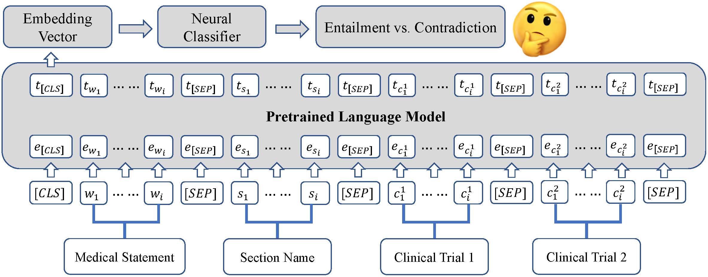

# KnowComp at SemEval2023 Task7 (NLI4CT)

This is the official code repository for the [SemEval2023](https://semeval.github.io/SemEval2023/) paper: KnowComp at
SemEval-2023 Task 7: Fine-tuning Pretrained Language Models for Clinical Trial Entailment Identification.
Our system officially ranks No.5th on the leaderboard and achieves an F1 score of 0.764.



## 1. Data Preparation

Please download the full CT records dataset
from [here](https://hkustconnect-my.sharepoint.com/:f:/g/personal/wwangbw_connect_ust_hk/Et2fjx8jxWVGkAdMpmORxD8BJOjRm1EfNu3spjDx8CWVtQ).
Then, put the `Complete_dataset` folder under the `data/` directory.

## 2. Required Packages

Required packages are listed in `requirements.txt`. Install them by running:

```bash
pip install -r requirements.txt
```

## 3. Training

Train the model with the following command:

```bash
python train.py \
       --ptlm microsoft/deberta-v3-large \
       --lmn deberta \
       --task_name atomic \
       --data ./data/Complete_dataset \
       --epoch 20 \
       --eval_every 10 \
       --prompt 2 \
       --mode trn \
       --gpu 0 \
       --seed 621
```

Our system's best model, which is based on a pretrained DeBERTa-v3-Large model, is
available [here](https://hkustconnect-my.sharepoint.com/:f:/g/personal/wwangbw_connect_ust_hk/Et2fjx8jxWVGkAdMpmORxD8BJOjRm1EfNu3spjDx8CWVtQ).
The `from_check_point`, `model_dir`, and `tokenizer_dir` arguments can be used to load the pretrained weight.

## 4. Citing this work

Please use the bibtex below for citing our paper:

```bibtex
@inproceedings{KnowCompNLI4CT,
  author       = {Weiqi Wang and
                  Baixuan Xu and
                  Tianqing Fang and
                  Lirong Zhang and
                  Yangqiu Song},
  title        = {KnowComp at SemEval-2023 Task 7: Fine-tuning Pre-Trained Language Models for Clinical Trial Entailment Identification},
  year         = {2023},
  booktitle    = {Proceedings of the 17th International Workshop on Semantic Evaluation, {SemEval} 2023}
}
```
